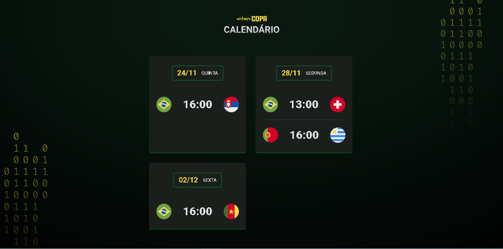

<h1 align = "center"> NLW #10 Copa </h1>

 
Evento exclusivo e gratuito,promovido pela Rockeatseat para ensino de tecnologias WEB.

<a href="#-tecnologias">Tecnologias</a>&nbsp;&nbsp;&nbsp;|&nbsp;&nbsp;&nbsp;
<a href="#-projeto">Projeto</a>&nbsp;&nbsp;&nbsp;|&nbsp;&nbsp;&nbsp;
<a href="#-layout">Layout</a>&nbsp;&nbsp;&nbsp;|&nbsp;&nbsp;&nbsp;
<a href="#-memo-licença">licença</a>

 
 

 

 

<h1> 🚀 Tecnologias</h1>
Esse projeto foi desenvolvido com as seguintes tecnologias:
<ul>
    <li>
        HTML e CSS
    </li>
    <li>
        JavaScript
    </li>
    <li>
        Git e Githu
    </li>
</ul>
<h1>💻 Projeto</h1>

O Calendário da Copa é um projeto que mostra os jogos da Copa de 2022

<h1>🔖 Layout</h1>

Você pode visualizar o layout do projeto através DESSE <a href = "https://www.figma.com/file/7UefW9rIBv8rQDdFL8NGUh/NLW-Copa-Explorer-Copy?fuid=1151305705893052012">LINK</a>. É necessário ter conta no <a href = "https://www.figma.com/files/recent?fuid=1151305705893052012">Figma</a> para acessá-lo.

<h1>📝 Licença </h1>

Esse projeto está sob a licença MIT.

